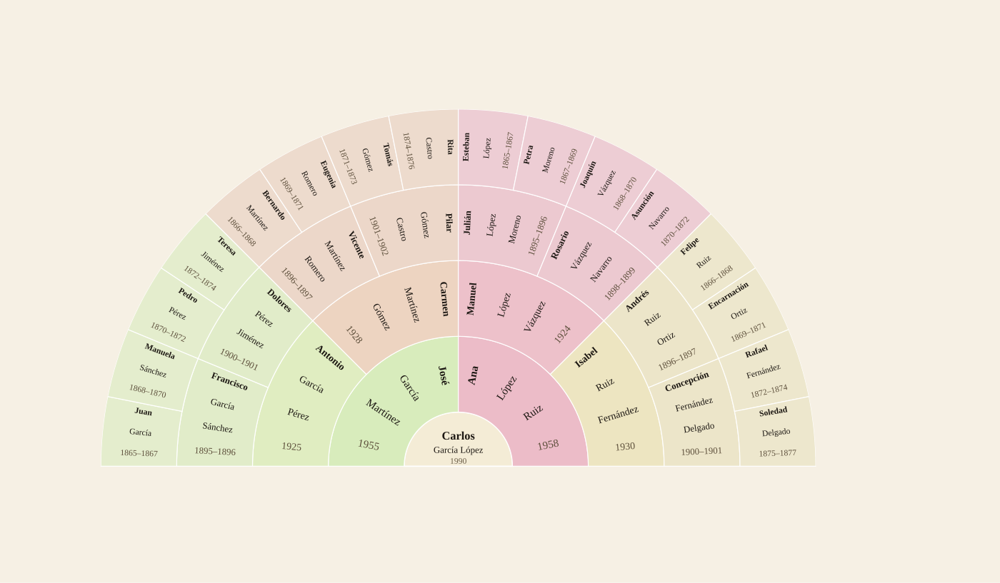
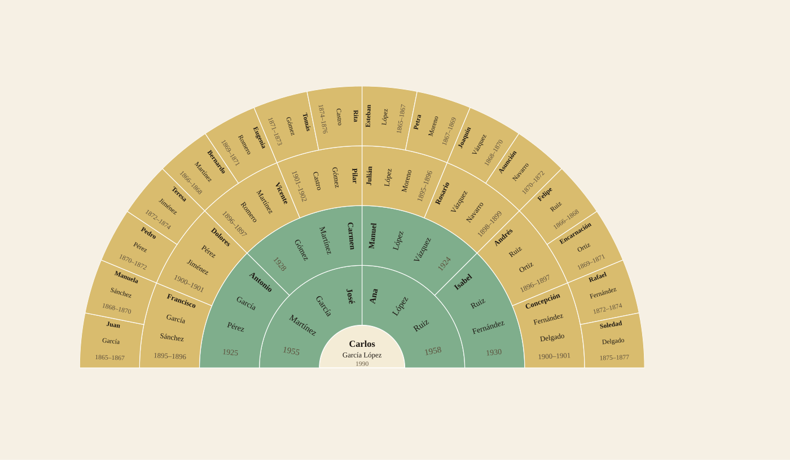
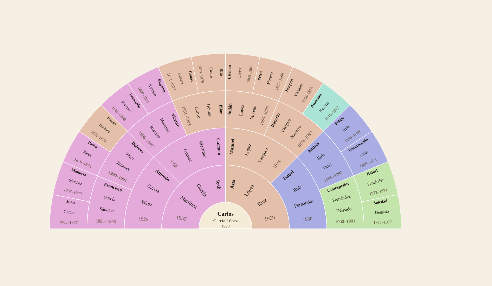
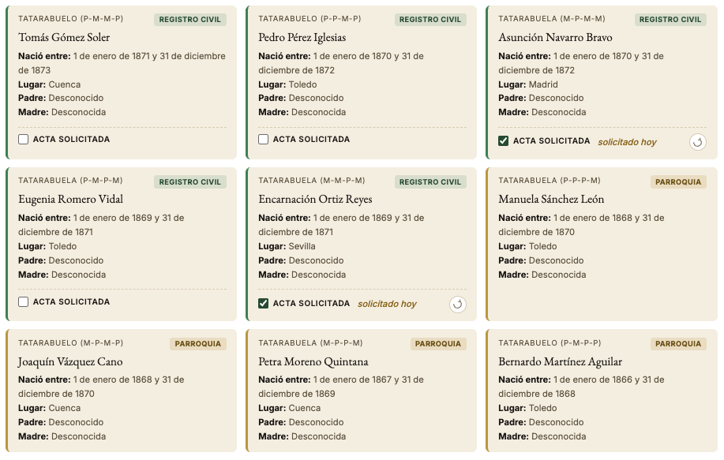

<div align="center">


# Propancestor

**Genealogy research tool for personal family trees — a single HTML file, no frameworks, no build, no npm.**

[](https://developer.mozilla.org/docs/Web/JavaScript)
[](https://supabase.com)
[](https://ubiquitous-cat-fb3b45.netlify.app)
[](#license)
[]()

### [Use the app now](https://ubiquitous-cat-fb3b45.netlify.app)

*Open `index.html` in any browser, or just use the link above — no installation required. You can create an account there if you want your tree synced across devices (optional).*

[🇪🇸 Español](README.md) · 🇬🇧 **English**

</div>

---

## What is this?

**Propancestor** is a web app for researching and visualizing your family tree. It's built for people searching civil registry and parish records in Spain: every certificate you find gets entered into the tree, date ranges are triangulated against children's and siblings' data, and the next record to look for surfaces on its own — ranked by likelihood and by which archive to query.

The entire app fits in a single `index.html`. It works offline via `localStorage` and syncs to the cloud through Supabase when there's a connection. Zero browser dependencies, zero build steps.

---

## Why Propancestor?

Most online family-tree tools (FamilySearch, MyHeritage, Geni...) are built for diasporas: families who migrated across countries over the centuries, whose tree spans continents within a few generations. **Propancestor comes from a different case: Spanish families with little to no geographic mobility**, where what matters isn't which *country* an ancestor passed through, but which *town*.

1. **Town-level granularity, not country-level.** Where FamilySearch gives you a "country" field per person, here every profile carries its birth municipality, and the fan chart can be colored by town to instantly see how family roots cluster — or scatter — within the same region.

2. **Built around the traceability of the Spanish surname system.** In Spain, women don't lose their surname when they marry, and every person carries two surnames (one from each parent) instead of just one. That gives a documentary traceability that doesn't exist in most other countries, and it's exactly what powers the propagation described in the next point: a maternal surname on a record identifies a whole lineage directly, instead of dissolving after one generation.

3. **Propagating information upward, toward earlier generations.** When you enter the data from an ancestor's birth record (civil or parish), the app doesn't just log that one person — it automatically pre-fills the parents' profiles with whatever the record already states (name, declared age, place of origin), ready for you to request *their* records next. And if that same record also states the age and hometown of the grandparents — common in older records — **Propancestor** goes one step further and pre-fills the grandparents' profiles too. A single trip to the registry or archive can uncover three generations at once.

4. **Birth-date-range calculator.** Every record gives a declared age for the parents at that moment; the app cross-references that against siblings and descendants to narrow down, through window intersection, the real birth range of each ancestor — even ones for whom you'll never find a record of their own.

5. **Document-routing guidance specific to the Spanish case.** The app automatically determines whether a record must be requested from the **Civil Registry** (births from January 1st, 1871 onward) or from the **parish archive** (anything earlier), and lets you flag when a request has been rejected at one or the other so priorities can be reshuffled. The "records to find" list can be sorted by most recent birth date (the easiest to obtain first) and filtered by town, so that when you plan a single visit to one parish archive, you already have the full list of records you can request there.

---

## The fan chart

The visual core is an editable radial fan chart, with longitudinal text (names read along the radius) and three coloring modes:

### By lineage
Each quadrant inherits a distinct hue, with saturation increasing alongside how much is known about that person.

<p align="center"></p>

### By record status
Green if the certificate has been obtained, amber if it's ready to be requested, maroon if the source ranges don't overlap.

<p align="center"></p>

### By birth town
A unique HSL color per municipality in the tree, with an automatic legend.

<p align="center"></p>

### "Records to find" panel
A prioritized list of pending records, classified as Civil Registry / Parish / exhausted routes, filterable by town and sortable by birth date. The "Record requested" tick starts a per-person day counter.

<p align="center"></p>

---

## Features

- **Range triangulation.** If you know your great-grandfather was 27 when your grandmother was born (her record) and 33 when your great-uncle was born (his record), the great-grandfather's birth range is computed from the intersection of both windows.
- **Bidirectional propagation.** The birthplace entered in a father's profile gets replicated into the "father's origin" field of his child's record, and vice versa. If both ends have an exact date, the declared ages get recalculated into the actual age.
- **"Records to find" panel.** A list of the next records to chase, with a one-click link to the Spanish Ministry of Justice's online portal and a step-by-step guide for filling out the request form.
- **"Record requested" tick.** A per-person waiting-day counter, resettable when you re-request from a different archive. It closes automatically once you enter the exact date, or manually with the ✓ button.
- **Response time per town.** "Tiempos" tab showing the average number of days the Civil Registry of each town takes to answer, computed from records that completed the full requested → obtained cycle, sorted slowest first. A "Recently obtained records" subsection on the records-to-find page lets you undo a misclick, manually entering how many days it had been waiting.
- **Most common surnames.** Counted and grouped by lineage (paternal/maternal), with variant normalization (`Díaz-Maroto` / `Diaz Maroto` / `de Diaz Maroto` all count as the same surname).
- **Inconsistency detection.** Warnings when the declared ages on a child's record and a sibling's record produce non-overlapping ranges, or when a grandchild's surnames don't match the grandparent's.
- **Deaths.** Per-person date and place of death fields, with "was already deceased on the child's record" hint propagation.
- **Settings modal.** Account, JSON/GEDCOM import, JSON/GEDCOM export. Animated SVG logo on the left, gear icon on the right.
- **Comparison before importing or syncing.** If the JSON/GEDCOM you import, or the tree in your account when you log in, doesn't match what's already on this device, a warning shows the person/sibling count on each side and three explicit choices — merge (field by field, nothing already verified gets lost), keep the current tree, or replace it with the incoming one — so no import or login can ever wipe genealogical data without you deciding it.
- **Offline-first.** The whole app lives in `localStorage`. When there's a connection, an outbox syncs changes to Supabase.
- **Zero emojis in production.** An internal SVG icon library (`ICONS`) replaces emojis entirely, for consistent rendering across iOS, Android, and desktop.
- **iOS-safe.** No optional chaining, no nullish coalescing, no `continue` inside `forEach`. Tested on older iOS Safari versions.

---

## Stack

| Layer | Technology |
|------|------------|
| **Frontend** | A single HTML file with inline `<style>` and `<script>`. Strict ES5 vanilla JS. No frameworks. |
| **Backend** | [Supabase](https://supabase.com) — Postgres + Auth + Row Level Security. A `trees` table and a `persons` table with a `data JSONB` column that accepts any structure with zero migrations. |
| **Local persistence** | `localStorage` with an outbox for changes pending while offline. |
| **Hosting** | [Netlify](https://www.netlify.com), `index.html` at the root. Continuous deploy from `main`. |
| **Icons** | Minimal inline SVG, Feather/Lucide style, `stroke=currentColor` for color inheritance. |
| **Typography** | EB Garamond (headings) + Inter (UI). Served via `<link>`, not `@import` (WKWebView compatibility). |

---

## How I use it for my own tree

1. **Download or clone the repo** and open `index.html` in your browser (double-click works too — no server needed).
2. Your own profile (the "proband") appears at the center of the fan chart. Click an empty sector to open its profile and fill in what you know.
3. Every time you enter a declared age, a birthplace, or a grandparent's name on a descendant's record, that data automatically propagates to the corresponding profile.
4. Once a profile has an estimated date and place, it shows up under the **Records to find** tab with its classification (Civil Registry ≥1871 or Parish <1871).
5. For Civil Registry ones, the **Request certificate** button opens the Ministry of Justice's online portal and shows the step-by-step guide.
6. Tick "Record requested" to start the waiting-day counter. Once you receive the certificate and enter the exact date, the record disappears from the pending list.
7. (Optional) Set up your own Supabase project — see the next section — to sync across devices. Without it, the app works exactly the same in local mode.

---

## Deploying your own backend

The `index.html` in this repository **does not include real credentials** — you'll see `TU_SUPABASE_URL_AQUI` instead. Without them the app works just as well, falling back automatically to **local mode** (everything in `localStorage`, no cloud sync). To get cross-device sync:

1. Create a free project at [supabase.com](https://supabase.com).
2. Run the SQL in [`supabase_schema.sql`](supabase_schema.sql) in the SQL Editor. This creates the `trees` and `persons` tables, plus the RLS policies so each user only sees their own data.
3. In `index.html`, replace `SUPABASE_URL` and `SUPABASE_ANON_KEY` with your project's own values (found under *Project Settings → API*).
4. Deploy `index.html` to Netlify (or GitHub Pages, Vercel, Cloudflare Pages, an S3 bucket, whatever — it's a static file).

> ⚠️ Supabase's `anon key` is public by design. Real security comes from RLS policies, not from hiding the key. Even so, this repo doesn't expose any real project, to avoid cross-traffic on someone else's account.

---

## Repository structure

```
.
├── index.html                  # The entire app (~3,300 lines)
├── arbol_datos_ejemplo.json    # Fictional dataset for testing import
├── supabase_schema.sql         # Tables and RLS to replicate the backend
├── docs/
│   ├── logo.svg                # Project logo
│   ├── fan_branch.png          # Fan chart by lineage screenshot
│   ├── fan_status.png          # Fan chart by status screenshot
│   ├── fan_town.png            # Fan chart by town screenshot
│   └── actas_pendientes.png    # Records panel with waiting-day counter screenshot
├── README.md                   # Spanish version
└── README.en.md                # This file (English)
```

---

## Philosophy

- **A single file.** No build, no transpilation, no dependency trees. Open the HTML in any browser and the app just works.
- **No frameworks.** The complexity already lives in the domain (genealogy, data propagation, range triangulation). It doesn't need React on top.
- **Local-first.** Your data lives on your device. The cloud is an optional mirror, not the source of truth.
- **Data over style.** The fan chart is the heart of the app, but the priority is that the data stays consistent and that triangulation works. The interface is just the medium for seeing it.

---

## Roadmap

- [ ] Smart import of scanned records (OCR)
- [ ] Map view of the tree's towns and generational movement
- [ ] Longevity statistics per lineage
- [ ] PDF export of the fan chart
- [ ] Federated search across open diocesan archives

---

## License

[GPLv3](LICENSE). You're free to use, study, modify, and redistribute it, as long as any modified version you distribute remains open source under the same license — no closed or proprietary forks allowed.

---

<div align="center">
<sub>Made with care in Madrid · 2026</sub>
</div>
